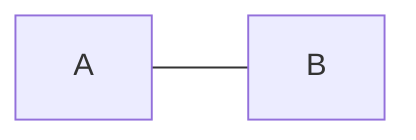

# 📌 マーメイド

GitHubでマーメイド記法を使って、グラフやチャートを書くための基本的な構文をまとめたチートシートです。

詳細は、[Mermaid User Guide](https://mermaid.js.org/intro/getting-started.html)をご確認ください。

## セクション一覧

- [フローチャート](./mermaid/flowchart)
  - 【**要素（ノード・矢印・関係）**】
    - [開始](./mermaid/flowchart/start.md)
    - [終了](./mermaid/flowchart/stop.md)
    - [データベース](./mermaid/flowchart/database.md)
    - [ラベル](./mermaid/flowchart/label.md)
  - 【**つなげ方**】
    - [上から下につなぐ](./mermaid/flowchart/top-to-down.md)
    - [下から上につなぐ](./mermaid/flowchart/bottom-to-top.md)
    - [左から右につなぐ](./mermaid/flowchart/left-to-right.md)
    - [右から左につなぐ](./mermaid/flowchart/right-to-left.md)
    - [上から下、左から右につなぐ](./mermaid/flowchart/top-to-down-and-left-to-right.md)
    - [開始 :arrow_right: 処理 :arrow_right: データベース :arrow_right: 終了](./mermaid/flowchart/start-process-databse-end.md)
 

## 書き方
1. コードブロックに「**mermaid**」を付ける
2. 「**flowchart**」または「**graph**」の後に、「**方向**」を示すオプションを付ける
3. その下に、**要素** を記載していく


```
flowchart TD;
    A-->B;
    A-->C;
    B-->D;
    C-->D;
```


```
graph LR
    A --- B
```


