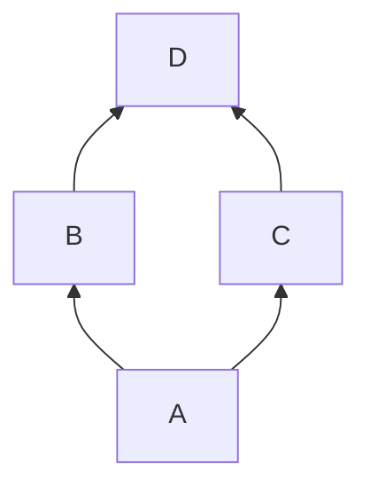

# 📌 下から上につなぐ

:information_source: 「**BT**」は「**Buttom to Top**」のこと

## 書き方

```
flowchart BT;
    A-->B;
    A-->C;
    B-->D;
    C-->D;
```


```
graph BT;
    A-->B;
    A-->C;
    B-->D;
    C-->D;
```

