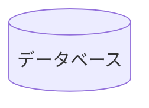
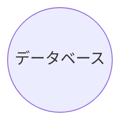

# 📌 データベース

:information_source: 「id1」はノードを一意に識別するもの（任意でつけられる）

## 書き方

```
flowchart LR
    id1[(データベース)]
```



```
graph LR
    id1[(データベース)]
```


```
flowchart LR
    id1((データベース))
```



```
graph LR
    id1((データベース))
```


