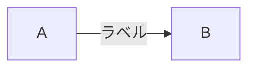
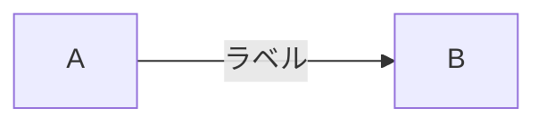

# 📌 ラベル


## 書き方

```
flowchart LR
   A-- ラベル --> B
```


```mermaid
flowchart LR
   A-- ラベル --> B
```

```
graph LR
   A-- ラベル --> B
```


```mermaid
graph LR
   A-- ラベル --> B
```


```
flowchart LR
   A--->|ラベル|B
```


```mermaid
flowchart LR
   A--->|ラベル|B
```

```
graph LR
   A--->|ラベル|B
```


```mermaid
graph LR
   A--->|ラベル|B
```
