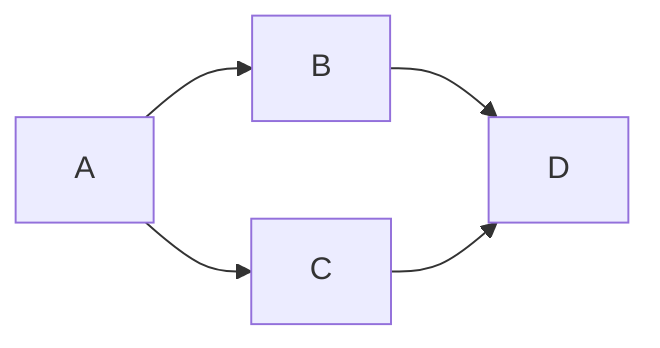

# 📌 左から右につなぐ

:information_source: 「**LR**」は「**Left to Right**」のこと

## 書き方

```
flowchart LR;
    A-->B;
    A-->C;
    B-->D;
    C-->D;
```


```
graph LR;
    A-->B;
    A-->C;
    B-->D;
    C-->D;
```

