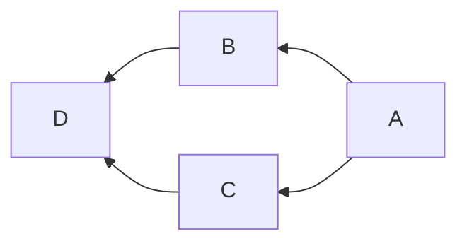

# 📌 右から左につなぐ

:information_source: 「**RL**」は「**Right to Left**」のこと

## 書き方

```
flowchart RL;
    A-->B;
    A-->C;
    B-->D;
    C-->D;
```


```
graph RL;
    A-->B;
    A-->C;
    B-->D;
    C-->D;
```

