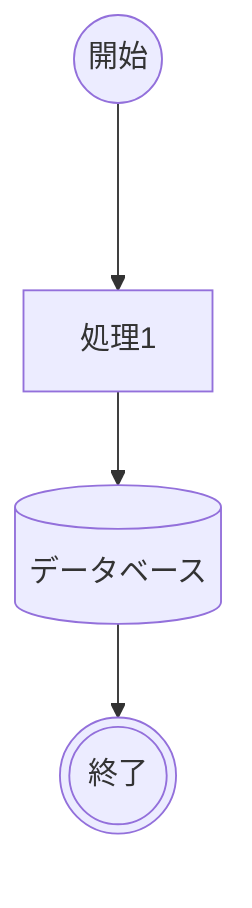
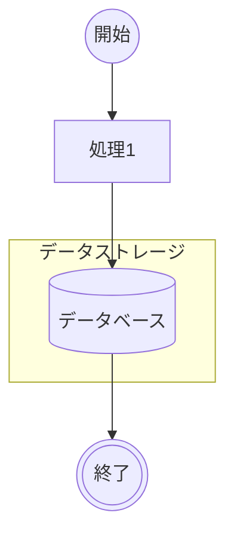

# 📌 開始 :arrow_right: 処理 :arrow_right: データベース :arrow_right: 終了


## 書き方


```
flowchart TD
    start@{ shape: circle, label: "開始" }--->処理1
    db[(データベース)]
    処理1-->db
    db-->stop@{ shape: dbl-circ, label: "終了" }
```



```
graph TD
    start@{ shape: circle, label: "開始" }--->処理1
    db[(データベース)]
    処理1-->db
    db-->stop@{ shape: dbl-circ, label: "終了" }
```


```
flowchart TD;
    start@{ shape: circle, label: "開始" } --> 処理1
    処理1 -->db1
    
    subgraph データストレージ
        db1[(データベース)]
    end

    db1 --> stop@{ shape: dbl-circ, label: "終了" }
```



```
graph TD;
    start@{ shape: circle, label: "開始" } --> 処理1
    処理1 -->db1
    
    subgraph データストレージ
        db1[(データベース)]
    end

    db1 --> stop@{ shape: dbl-circ, label: "終了" }
```


