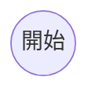

# 📌 開始

## 書き方

```
flowchart TD
    A@{ shape: circle, label: "開始" }
```


```mermaid
flowchart TD
    A@{ shape: circle, label: "開始" }
```

```
graph TD
    A@{ shape: circle, label: "開始" }
```


```mermaid
graph TD
    A@{ shape: circle, label: "開始" }
```
