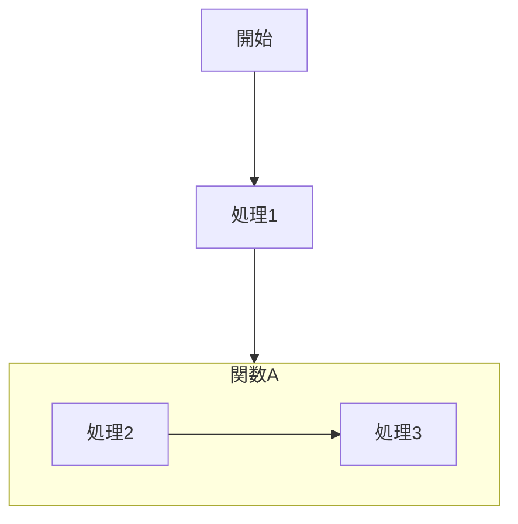

# 📌 上から下、左から右につなぐ


## 書き方

```
flowchart TD
    開始--->処理1
    subgraph 関数A
    direction LR
    処理2--->処理3
    end
    処理1--->関数A   
```



```
graph TD
    開始--->処理1
    subgraph 関数A
    direction LR
    処理2--->処理3
    end
    処理1--->関数A   
```


